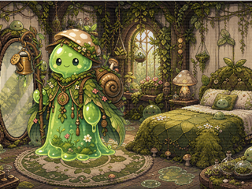

# OC TV Tower Demo

这是一个纯前端的 3D 电视塔视觉/交互 demo。玩家主要在塔内部飞行，看到由复古 CRT 电视组成的圆形楼层。每台电视可以显示一个 OC 房间窗口，也可以处于未入驻的无信号状态。

当前版本不依赖构建工具，不需要 npm。它使用原生 HTML / CSS 3D / JavaScript，可以直接作为前端模块接入其他项目。

## 快速运行完整 Demo

终端 1，启动 Living World API：

```powershell
cd M:\code\hackthon\kaleidoroom\services\api
python -m uvicorn app.main:app --host 127.0.0.1 --port 8000
```

终端 2，启动电视塔及同源 API 代理：

```powershell
cd M:\code\hackthon\TV-Demo
node Tower\demo-server.cjs
```

打开：

```text
http://127.0.0.1:5177/?roomApp=http%3A%2F%2F127.0.0.1%3A4174%2F
```

页面先请求 `POST /api/living-world/day-loop-runs` 播放第 1 天，再通过同一
`runId/advance` 读取服务端持久化状态与私有记忆，继续播放下一天。每一天只播放
`planned → travelling → arrived → in_event → complete` 一次；展示层把 `in_event`
拆成“各自行动”和“规则检定”两拍，所以观众能在约 36 秒内看完当天的六个画面。
公共结果出现时 OO / CC 会回到可进入状态。进入 Room 前保存最后一次真实投影，
返回电视塔后从同一浏览器会话恢复相同 `runId` 与 day，再继续调用原 run 的 `advance`。
API 不可用时会明确显示
`PREVIEW · OFFLINE`，并只运行奶蛙视觉预览。

## 只看静态视觉

在 `Tower` 文件夹下启动本地静态服务：

```powershell
python -m http.server 5177 --bind 127.0.0.1
```

打开：

```text
http://127.0.0.1:5177
```

## 操作方式

- `WASD`：水平飞行
- `Space`：向上飞
- `Shift`：向下飞
- 鼠标拖拽空白区域：转动视角
- 鼠标悬停电视：该电视变亮
- 鼠标点击电视：选中该房间，右下角显示当前房间信息

## 源码结构

```text
Tower/
  index.html                  页面入口
  styles.css                  全部视觉样式、3D 样式、电视亮暗状态、无信号效果
  app.js                      生成电视塔、播放投影状态、飞行与点击
  room-bridge.js              Room deep link 与 Day Loop DTO 映射
  demo-server.cjs             无依赖静态服务与本地 API 代理
  README.md                   当前总说明文档
  docs/
    INTEGRATION.md            后端/外部项目接入接口说明
  assets/
    tv-cutout/                网页实际使用的透明 PNG 电视框
    tv-web/                   压缩后的电视素材中间版本
    tv-source/                原始电视素材副本
    tv/                       早期透明化尝试，仅保留备份
    residents/                楼层原始素材：OC、房间、wallpaper
    tv-content/               已合成好的电视屏幕内容图
```

## 当前楼层

楼层配置在 `app.js` 的 `FLOORS` 数组里：

```js
const FLOORS = [
  { name: "CuteCore", y: 1140, hue: "cute", folder: "CuteCore", ids: [1], spin: -0.018 },
  { name: "SlimeCore", y: 380, hue: "slime", folder: "SlimeCore", ids: [1, 2, 3, 4, 7, 8], spin: 0.017 },
  { name: "SteamPunkCore", y: -380, hue: "steam", folder: "SteamPunkCore", ids: [1], spin: -0.015 },
  { name: "WeirdCore", y: -1140, hue: "weird", folder: "WeirdCore", ids: [1, 2, 3], spin: 0.018 },
];
```

字段含义：

- `name`：楼层显示名，也会进入电视的 `data-room`
- `y`：楼层高度
- `hue`：楼层视觉主题，对应 CSS 里的 `.mega-floor[data-variant="..."]`
- `folder`：素材文件夹名，对应 `assets/residents/<folder>` 和 `assets/tv-content/<folder>`
- `ids`：该楼层可循环使用的住户编号
- `spin`：该大层基础旋转速度

## 当前电视数量

电视塔参数在 `app.js` 顶部：

```js
const COLS = 26;
const ROWS = 4;
const RADIUS = 690;
const PANEL_RADIUS = 780;
const ROW_OFFSETS = [-231, -77, 77, 231];
```

当前每层是 `4 行 x 26 列`，共 104 台电视。当前 4 个楼层总共 416 台电视。

重要半径关系：

- `RADIUS = 690`：电视圆环半径
- `PANEL_RADIUS = 780`：楼层 wallpaper 背景半径

玩家在塔内部飞行时，顺序是：

```text
玩家 -> 电视机/电视屏幕 -> wallpaper 背景
```

所以 wallpaper 不会插到电视前面。

## 电视状态

每台电视有两种状态：

- `occupied`：已入驻，显示 OC + 房间内容
- `vacant`：未入驻，显示 CSS 无信号/待机效果

生成逻辑在 `app.js`：

```js
function hasResident(row, col, floorIndex) {
  return ((row * 7 + col * 5 + floorIndex * 11) % 10) < 4;
}
```

当前大约 40% 电视是已入驻，60% 是无信号。这样可以减少亮屏数量，也能降低图片加载量。

如果想让所有电视都有住户，把它改成：

```js
function hasResident() {
  return true;
}
```

如果想让更少电视亮着，把 `< 4` 改成更小，例如 `< 2`。

## 电视 DOM 结构

已入驻电视：

```html
<button class="tv-slot" data-room="SlimeCore · R1-1" data-status="occupied">
  <span class="tv-screen">
    
  </span>
  
</button>
```

未入驻电视：

```html
<button class="tv-slot" data-room="SlimeCore · R1-2" data-status="vacant">
  <span class="tv-screen tv-screen--vacant"></span>
  
</button>
```

## 接入房间点击

点击入口在 `app.js`：

```js
function selectTv(tv) {
  selectedTv?.classList.remove("is-selected");
  selectedTv = tv;
  selectedTv.classList.add("is-selected");
  selection.hidden = false;
  selectionName.textContent = tv.dataset.room;
}
```

后续可以在这里接入：

- 跳转房间页面
- 打开弹窗
- 调用后端接口
- 发送当前房间 ID 给游戏逻辑
- 加载该电视对应 OC / 房间详情

每台电视目前可以读取：

```js
tv.dataset.room      // 例如 "SlimeCore · R2-8"
tv.dataset.variant   // 楼层风格，例如 "slime"
tv.dataset.tv        // 使用的电视框类型，0-7
tv.dataset.status    // "occupied" 或 "vacant"
```

更完整的接入建议见：

```text
docs/INTEGRATION.md
```

## 素材约定

### 楼层原始素材

位置：

```text
assets/residents/<FloorName>/
```

当前例子：

```text
assets/residents/SlimeCore/
  1_oc.png
  1_room.png
  2_oc.png
  2_room.png
  wallpaper.jpg
```

命名规则：

- `<id>_oc.png`：角色图
- `<id>_room.png`：房间图
- `wallpaper.jpg`：楼层背景

如果某个编号缺少 OC 或 room，当前不会自动生成屏幕内容。例如只有 `5_oc.png` 但没有 `5_room.png`，这组不会出现在 `tv-content` 里。

### 电视屏幕内容

位置：

```text
assets/tv-content/<FloorName>/<id>.png
```

这些是已经预合成好的小图，尺寸为 `320 x 240`，也就是 4:3。

合成逻辑：

- 房间图铺满 4:3 背景
- OC 放在左侧偏前景
- 添加轻微暗角和扫描线
- 输出为电视屏幕贴图

网页运行时直接加载这些小图，而不是加载大型 OC / room 原图。

## 更换或新增楼层

1. 在 `assets/residents` 下新增文件夹，例如：

```text
assets/residents/CircusCore/
```

2. 放入素材：

```text
1_oc.png
1_room.png
2_oc.png
2_room.png
wallpaper.jpg
```

3. 生成对应的 `assets/tv-content/CircusCore/<id>.png`。

4. 在 `app.js` 的 `FLOORS` 添加：

```js
{ name: "CircusCore", y: -1900, hue: "circus", folder: "CircusCore", ids: [1, 2], spin: -0.014 }
```

5. 在 `styles.css` 添加楼层色彩：

```css
.mega-floor[data-variant="circus"] {
  --floor-bg: rgba(80, 0, 18, 0.86);
  --floor-glow: rgba(255, 30, 60, 0.2);
}
```

## 调整视觉

常用修改位置：

- 塔大小：`app.js` 的 `RADIUS` / `PANEL_RADIUS`
- 每层电视数量：`COLS` / `ROWS`
- 行距：`ROW_OFFSETS`
- 楼层高度：`FLOORS[*].y`
- 电视亮暗：`styles.css` 的 `.tv-slot`
- hover 亮起效果：`.tv-slot:hover`
- 未入驻无信号效果：`.tv-screen--vacant`
- 楼层背景透明度：`.floor-panel { opacity: ... }`
- 电视屏幕贴图位置：`.tv-slot[data-tv="0"]` 到 `.tv-slot[data-tv="7"]`

## 性能说明

当前页面会生成：

- 416 台电视
- 416 张电视框 PNG
- 约 169 张住户屏幕内容图
- 约 247 个 CSS 无信号屏幕

未入驻电视不加载住户图，只使用 CSS 效果，所以比所有电视都亮着更轻。

如果接入后端后数据量更大，建议：

- 继续保留 `vacant` 状态
- 只给近距离或可见楼层加载 OC/房间图
- 用后端返回缩略图，不要直接返回大图
- 保持电视屏幕内容为 4:3 小图，例如 `320x240` 或 `480x360`

## 当前已知限制

- 这是 CSS 3D demo，不是 Three.js/WebGL 场景。
- CSS 3D 的深度排序在极端角度可能不如 WebGL 稳定。
- 不同电视 PNG 的屏幕位置不同，现在用 `data-tv="0" ... "7"` 的 CSS 参数粗略对齐。
- 后续如果每台电视都需要精确屏幕遮罩，建议为每个电视型号建立独立 mask 或改用 canvas/WebGL。
